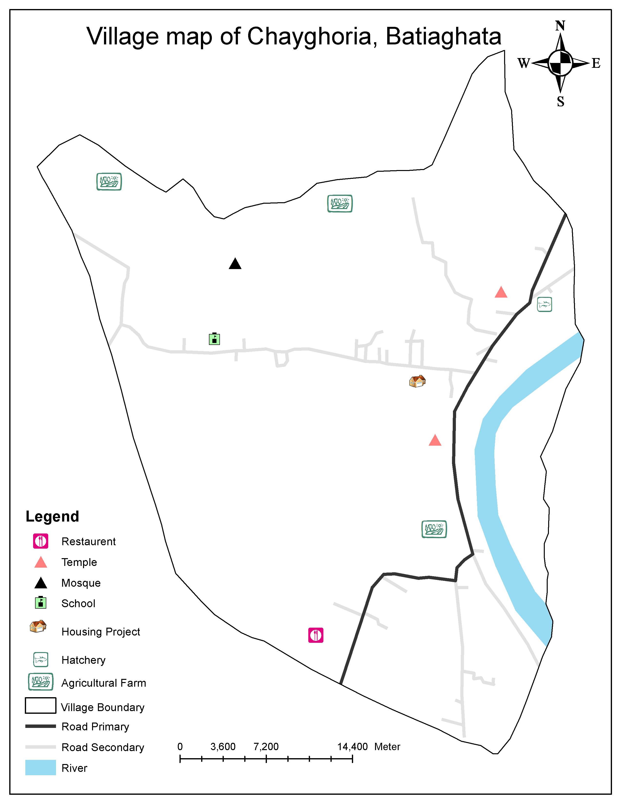
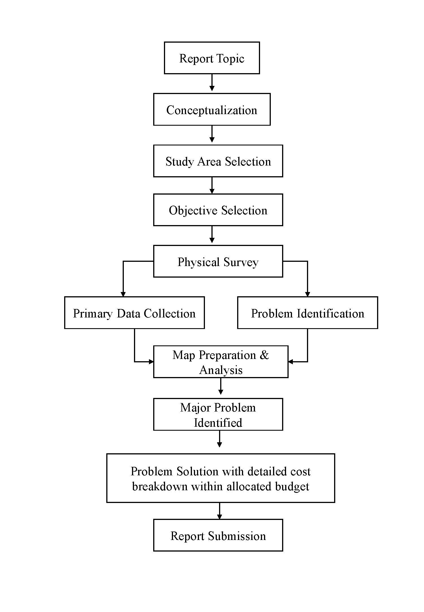
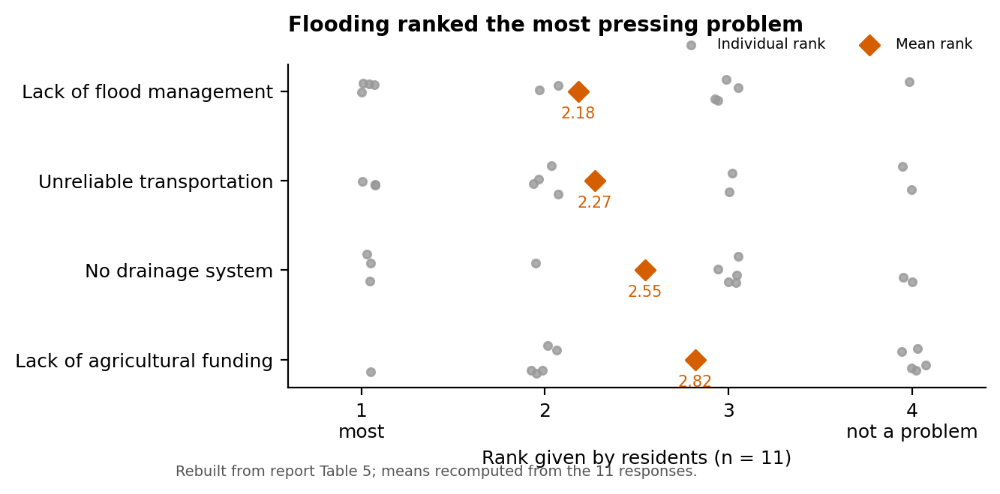
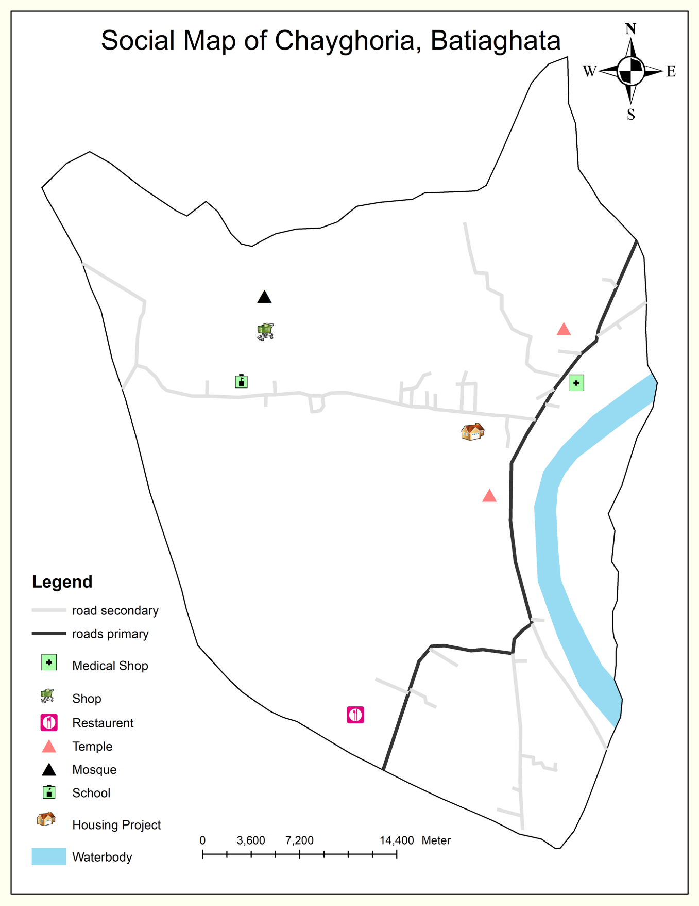
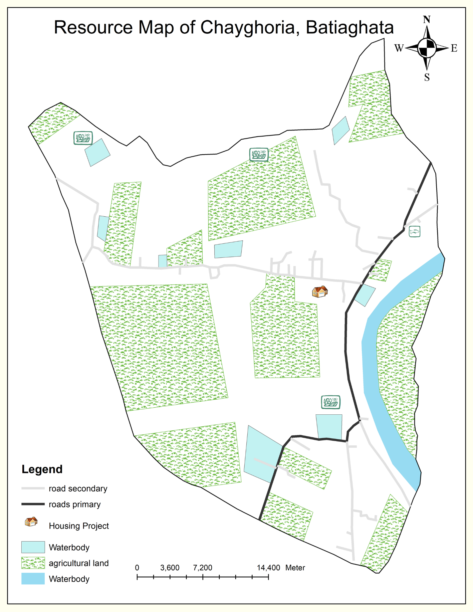
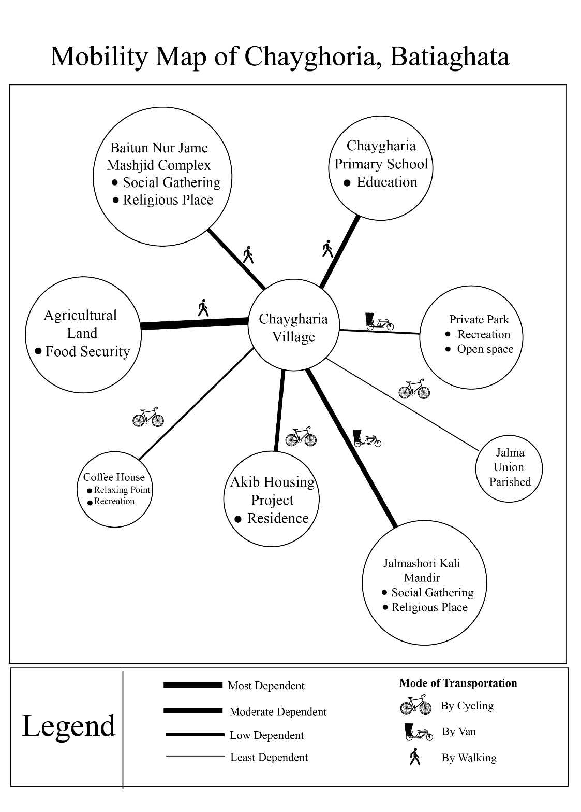
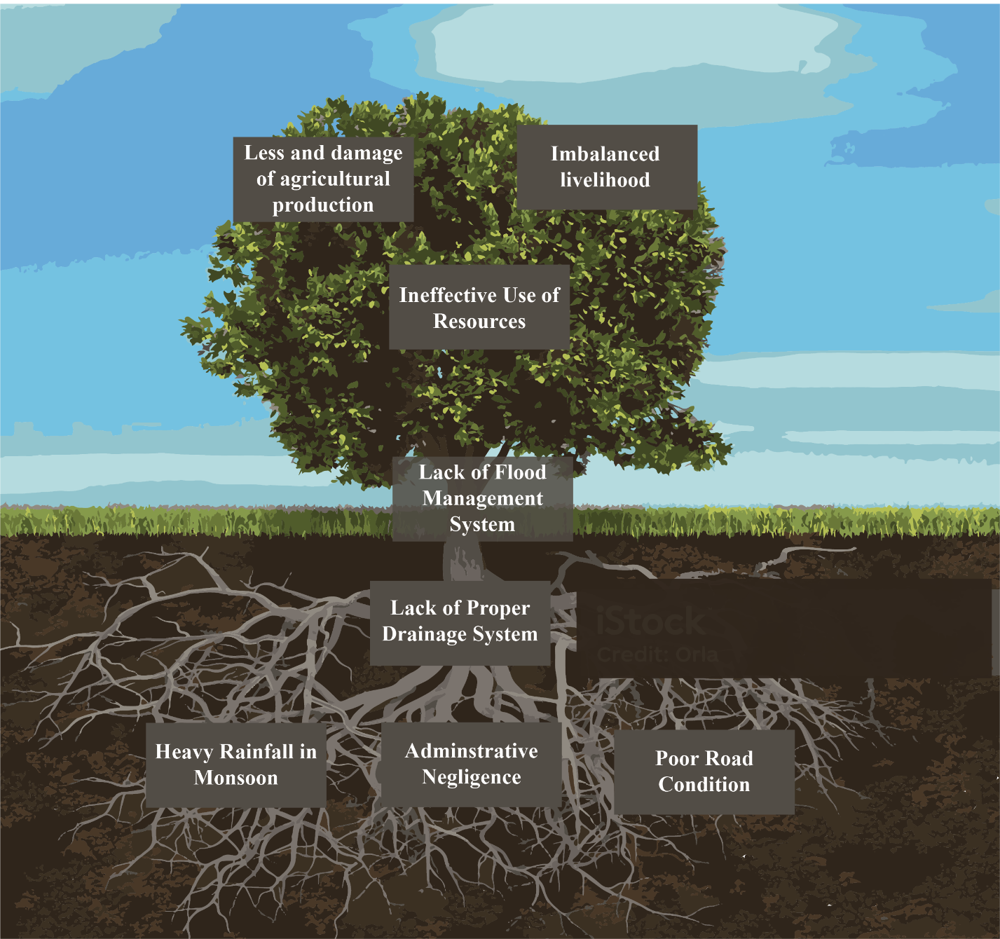
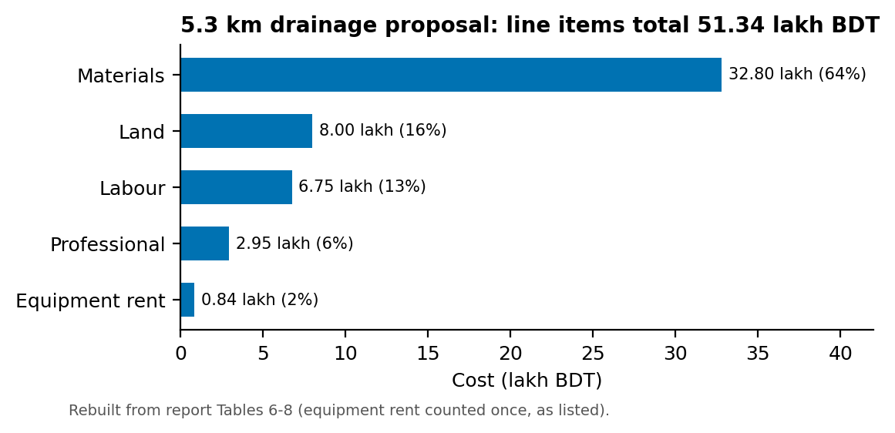

# Participatory Rural Appraisal and Drainage Proposal: Chayghoria, Batiaghata, Khulna


## Summary

Chayghoria is a low-lying farming village of about 1,570 people on the Rupsa River, around 10 km from Khulna city. It floods every monsoon and is affected by salinity. Our team ran a Participatory Rural Appraisal (PRA) with residents to find the village's main problems and a solution they could help build. We produced social, resource and mobility maps, a Venn diagram, a transect walk and a crop calendar with residents, then analysed the problems with a fishbone diagram, a problem tree and a resident ranking. **Lack of flood management** ranked as the most pressing problem (mean rank 2.18). We proposed a **5.3 km community-built drainage network** that discharges into the Rupsa River.



## Study area

Chayghoria village, Batiaghata Upazila, Khulna district: about 4 km² (988 acres), bordered by the Rupsa River to the east. Most land is agricultural, with rice (Aman, Aus, Boro) and winter vegetables.

## Data (primary, participatory)

| Tool | Purpose |
|---|---|
| Semi-structured interviews and group discussions | Identify issues and local knowledge |
| Social map | Roads, housing, schools, religious places, shops |
| Resource map | Farmland, ponds, water bodies, river |
| Mobility map | Where people travel, how often and by which mode |
| Venn diagram | Overlaps between land uses |
| Transect walk | Elements, advantages and disadvantages across the village |
| Crop calendar | Seasonal cropping and labour demand |
| Problem ranking | 11 residents ranked 4 problems from 1 (most) to 4 (not a problem) |

## Method



1. Formed the PRA team: team leader (me), two note-takers and two facilitators.
2. Built each participatory map and diagram with residents in the field and digitised them.
3. Identified four common problems in group discussion and ranked them with residents.
4. Traced causes and effects of the top problem with a fishbone diagram and a problem tree.
5. Designed a drainage solution with residents and estimated its cost.

## Results

- **Problem ranking (mean, lower = worse):** lack of flood management **2.18**, unreliable transport 2.27, no drainage system 2.55, lack of agricultural funding 2.82.
- **Root causes (problem tree):** no proper drainage, heavy monsoon rainfall, administrative neglect and poor road condition. These lead to crop damage, lost production and unstable livelihoods.
- **Proposal:** a 5.3 km drainage network of canals and culverts, built with villagers over about 3 months. The line items in the report total **BDT 51.34 lakh** (materials 64%, land 16%, labour 13%).



| Social map | Resource map | Mobility map |
|---|---|---|
|  |  |  |





The Venn diagram, transect walk and fishbone diagram are in [`images/`](images/).

## Tools

PRA field tools (participatory mapping, transect, crop calendar, ranking) · Digitised participatory maps · Microsoft Excel · Python/matplotlib (redrawn charts in [`viz/`](viz/))

## Repository contents

```
images/   original PRA maps and diagrams (unchanged) + redrawn charts
viz/      make_figures.py and data/*.csv (Tables 5-8 from the report; respondent names removed)
```

## Contact

Chinmoy Ghosh Shuvo · Open to collaboration and knowledge sharing. Feel free to reach out on [LinkedIn](https://www.linkedin.com/in/chinmoyghosh034).
